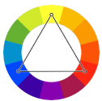

# **Piscologia das Cores**

## Harmonia das Cores
Escolher Uma boa harmonia de cores é muito importânte para o estilo do site.

- `Nota:` Sites com letras brancas e fundo preto causam cansaso visual.

## Círculo cromático
São combinações de cores que se dão bem.

 

  - Cores `Primárias`: Triângulo;
  - Cores `Secundárias`: Triângulo de cabeça para baixo;
  - Cores `Terciárias`: Hexagono;

### Temperatura e Harmonia
Entre o amarelo e o amarelo-esverdiado, é possível cortar linearmente e criar as cores frias (esquerda) e as cores quentes (direita).

 

## Classificações Harmônicas
- `Nota:` uma paleta pode ter de 3 até 5 cores

### Cores Complementates
São aquelas que têm o maior contraste entre si.

 

### Cores Análogas
São as cores adjacentes.
 
 

### Cores Análogas mais uma complementar
Uma técnica de design que consiste em pegar as cores análogas e mais uma complementar do índice da cor escolhida

 

### Cores Análogas Relacionadas
Uma técnica de design que consiste em pegar uma cor e outra adjacente, unidirecionalmente, pule a próxima cor, por fim, aposse-se à atual -pode-se pegar a adjacente ou o índice escolhido para a maneira do pulo-.

 

### Cores intercaladas
Uma técnica que consiste em um laço. Escolha a primeira cor e faça um intervalo, crie o laço, até as três cores estiverem apontadas.

 
 - Cores Triádicas
 
 - Cores em Quadrado
 
 - Cores Tetrádicas
 
 - Monocromia
 

