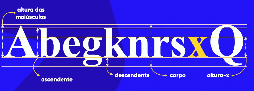
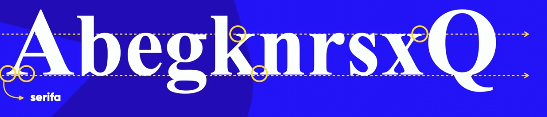
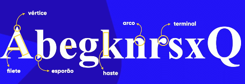
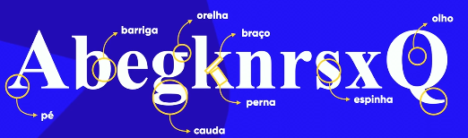
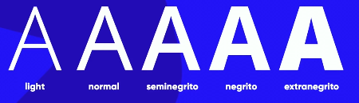
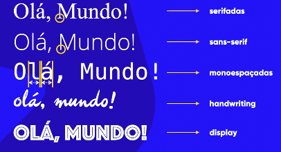

# **Tipografia**
Tipo = Týpos: Impressão
grafia = Graphía: Escrita

## Anatomia do Tipo
 - `Nota:` a letra 'x' define qual a altura base de todas as letras minúsculas
 ### Itens Métricos
 

 ### Anatômicos Geométricos
 
 

 ### Anatômicos não Geométricos
 

 ### letras
 
 

 ### Família Tipográfica
 

## Categoria de Fontes
 `Nota:` em textos muitos grandes dê preferência a fontes sans-serifadas

 